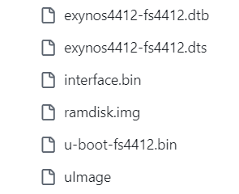

# AgriSmartMonitor - 智能农业监控系统

# 项目简介

AgriSmartMonitor 是一套面向现代化农业的**智能物联网监控系统**，通过整合传感器网络、嵌入式计算与 Web 可视化技术，实现农田环境（温湿度等）,农业用具（农用泼洒无人机状态、植物状态）的实时监测、设备远程控制、助力农业生产的精准化、高效化管理。

‍

# 系统概述

AgriSmartMonitor是基于Linux C和HTML界面编程，通过zigbee作为终端环境的采集或硬件的控制，将采集到的数据通过A9端的进程间通信和线程间同步互斥实现对数据的处理或存储，将通过共享内存和信号量将采集到的环境信息上传到网页，并通过消息队列接收来自客户端的请求，结合视频流摄像头实现图像的远程显示，保证master能实时把控农业环境状态。

‍

## 整体流程图

### 数据的上传（数据监控）

​​

### 数据的下发（控制外设）

​​

‍

‍

# 技术栈

## 硬件层

* 核心控制器：**ARM-A9** 嵌入式开发板。
* 主机系统支持：PC(LINUX)等主流主机。
* 存储设备：SD卡、EMMC、SCSI或IDE接口的硬盘。
* 传感器：温湿度传感器（DHT 系列）、MPU6050。
* 终端设备：ZigBee、STM32、RFID、cortex-A9、PC显示屏。
* 执行设备：风扇（通风）、LED 状态指示灯、蜂鸣器告警模块、摄像头。

## 软件层

* 开发平台： ubuntu20.04  vscode2025。
* 开发环境：  linux3.14.0、uboot2013.01、gcc4.6.4。
* 通信协议：单总线、I2C、串口、ZigBee、http协议。
* 服务端：Boa Web 服务器（轻量级 HTTP 服务）、mjpg-streamer（摄像头视频流服务）。

‍

# 运行步骤

## 环境搭建

1. 使用工具

    ​​

    先刷clear.bin（可能sd卡里面存储的乱七八糟的东西，需要给sd卡刷一个空文件进行清除）

    ```c
    sudo dd if=/dev/zero of=clear.bin count=2048
    ```

    再刷win-u-boot-fs4412.bin  
    刷入SD卡中
2. 你可以使用我提供的移植好的内核镜像、设备树等

    ​​

1. 板子的linux环境运行起来后，进入根目录下的配置/etc/init.d/rcS,为下面的

    ```c
    cd mjpg-streamer/
    ./start.sh &
    cd ..
    cd boa/
    ./boa &
    cd ..
    cd drv/
    ./run.sh &
    cd ..
    ```

2. 将mjpg-streamer放到根目录
3. boa文件放到根目录
4. 将 **/drivers/drv**里面的文件复制到板子linux系统下的 **/drv**即可
5. 再将我代码中 **/stage_storage/monitor_obj**（提起所有线程）在根目录下进行运行即可
6. 最后可以通过网页访问开发板的ip进行访问**boa服务器**

# 实验现象视屏
b站：【智能农业监控系统-陈】 https://www.bilibili.com/video/BV1N1kBBsE4X/?share_source=copy_web&vd_source=f04f562e6153e9553546ba49a0f62893


# 更新计划

1. 风扇，环境调整风扇起到散热效果，并且通过PWM调节转速提高适用性。
2. 添加sqlites线程，通过sqlites3数据库存储日志数据，如出现异常情况的数据存储进数据库中，方便后续对数据进行分析。
3. 添加GPRS线程，报警实现远程消息提醒。
4. 完善一些html上的显示BUG。

‍
